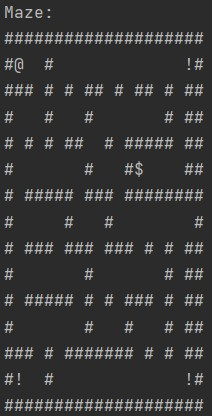

# Maze Game
Play this simple Maze Game with unique mazes in each run.
Locate and collect the power to kill all three monster before they kill you.

## Installation
1. Download, install and run [IntelliJ Community Edition](https://www.jetbrains.com/idea/download/)
2. Click "Get from VCS" or File->New->Project From Version Control
3. Insert the following URL:
```
https://github.com/Toooo123/Maze-Game.git
```
4. Run Main

## Game Information
### Directions
Kill 3 Monsters before getting eaten by a monster

### Legend
| Symbol | Object |
| :---: | :---: |
| # | Wall |
| @ | You (Hero) |
| ! | Monster |
| $ | Power |
| . | Unexplored Space|

### Moves
| Letter | Action |
| :---: | :---: |
| W | Up |
| A | Left |
| S | Down |
| D | Right |

### Special Keys
| Letter | Action |
| :---: | :---: |
| ? | Help |
| m | Display Map|
| c | Cheat |

### Sample Map


## Design
### Maze
The Maze is 20 cells wide and 15 cells tall.
Randomly generated mazes are made with recursive backtracker referring from [Wikipedia](https://en.wikipedia.org/wiki/Maze_generation_algorithm#Recursive_backtracker).
Corner walls are removed to allow the hero and monster to spawn.
Some inner walls are removed to allow the hero to navigate Maze easier.
All open cells in the maze is connected.
2x23 square constraint is satisfied so there no 2x2 wall or open cells.

### Hero
Hero will spawn in the top left of the Maze.
Inputting one of W, A, S, or D will move the hero unless a wall is in their way.
Collecting power will allow the hero to kill one monster.

### Monsters
Monsters will spawn in the three other corners.
They will wander through the maze randomly after each hero move.
They are not allowed to move through walls or immediately backtrack unless that is their only move.

### Power
The power will be randomly placed in the maze.
It cannot spawn on the hero or on walls.
After the hero collects a power, a new power will spawn.

### Class Diagram


### CRC Cards
